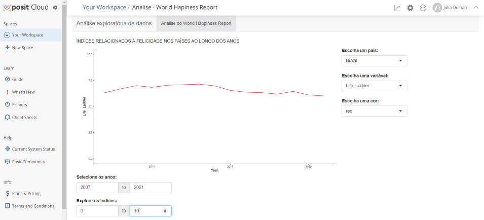

```{r setup, include=FALSE}
knitr::opts_chunk$set(echo = TRUE)
```


Fonte: World Hapiness Report Website


## FORMATO DO RELATÓRIO

**1 - O relatório final deve ser apresentado utilizando RMarkdown. Nesse relatório deve haver:**

**imagens estáticas ("prints" de tela, imagens da internet - com a devida fonte mencionada - ou figuras criadas pelo aluno fora do ambiente do R); imagens geradas através do ambiente R, particularmente com a biblioteca ggplot; links clicáveis (como fontes e referências). **

## BASE DE DADOS

**2 - Escolha uma base de dados para realizar esse projeto. Essa base de dados será utilizada durante toda sua análise. Essa base necessita ter 4 (ou mais) variáveis de interesse, onde todas são numéricas (confira com o professor a possibilidade de utilização de dados categóricos). Observe que é importante que haja dados faltantes em pelo menos uma variável para executar esse projeto. Caso você tenha dificuldade para escolher uma base, o professor da disciplina irá designar para você. Explique qual o motivo para a escolha dessa base e aponte os resultados esperados através da análise.**

A base foi escolhida por cumprir todos os requisitos necessários para a realização do trabalho, como variáveis numéricas e presença de dados faltantes. Além disso, decidi manter a base do trabalho anterior por já ter algum conhecimento que pode contribuir para realizar novas investigações. Dessa vez, porém, decidi filtrar os dados do Brasil - embora haja menos observações, acredito que olhar para uma realidade conhecida me auxiliará nos achados. Com a análise, pretendo identificar correlações que sugiram aspectos diretamentes relacionados à felicidade no Brasil e seus indicadores. Uma das intenções é tentar identificar momentos históricos que possam ter afetado esses dados, assim como entender o impacto de dados faltantes.

 
[Clique aqui para fazer o download da base](https://www.kaggle.com/datasets/jahaidulislam/world-happiness-report-2005-2021)

[Clique aqui para mais informações sobre o World Hapiness Report](https://worldhappiness.report/)

```{r carregando os dados, echo=TRUE, message=FALSE}
library(data.table)
world_happiness.data.table <- data.table::fread("World_Happiness_Report_2005-2021.csv", encoding = ('Latin-1'))
```

```{r ajustando os nomes da variáveis, echo = TRUE, message=FALSE}
library(dplyr)
limpeza.nomes <- function(nomes)
{
  nomes.limpos <- nomes %>% stringr::str_replace_all("/", "") %>% stringr::str_replace_all("\\s", "_") %>% stringr::str_replace_all("__", "_")
  return(nomes.limpos)  
}
names(world_happiness.data.table) <- limpeza.nomes(names(world_happiness.data.table))
names(world_happiness.data.table)
```

```{r filtrando apenas pelo Brasil, echo=TRUE, message=FALSE}
world_happiness.data.table.br <- world_happiness.data.table[Country_name == "Brazil"]
```

## DESCREVENDO ESTATISTICAMENTE

**3 - Utilizando o pacote summarytools (função descr), descreva estatisticamente a sua base de dados.**

```{r descrevendo estatisticamente com summarytools, echo = TRUE}
library(summarytools)
world_happiness.data.table.br %>% summarytools::descr()
```

## MATRIZ DE ESPALHAMENTO E CORRELAÇÕES

**4 - Crie um gráfico com a matriz de espalhamento (scatter matrix plot) para sua base de dados. Através de investigação visual, quais são as variáveis mais correlacionadas. Apresente o gráfico e justifique.**

Para a matriz de espalhamento, desconsiderei a variável 'Generosidade' devido à presença de dados faltantes. 

As variáveis mais correlacionadas foram 'Ano' e 'Expectativa De Vida Saudável ao Nascer', completamente correlacionadas, refletindo o aumento da expectativa de vida no Brasil no período analisado. 

Um achado curioso: 'Expectativa De Vida Saudável ao Nascer' está diretamente correlacionada a 'Afeto Negativo' e inversamente correlacionada a 'Afeto Positivo'.

Algumas outras correlações interessantes observadas foram entre 'Índice da Felicidade' e 'Suporte Social' (correlação direta), 'Índice da Felicidade' e 'Afeto Negativo' (correlação inversa), 'Percepção de corrupção' e 'Confiança no Governo Nacional' (correlação inversa), 'Suporte Social' e 'Afeto Negativo' (correlação inversa).

```{r criando matriz de espalhamento, echo = TRUE, message=FALSE}
pairs(world_happiness.data.table.br[, c("Year", "Life_Ladder", "Log_GDP_per_capita", "Social_support", "Healthy_life_expectancy_at_birth", "Freedom_to_make_life_choices", "Perceptions_of_corruption", "Positive_affect", "Negative_affect"), with=FALSE], lower.panel = NULL)
```

Também gerei uma matriz de correlação via corrplot para auxiliar na interpretação dos dados da scatter matrix.

```{r observando correlações com corrplot, echo = TRUE}
library(corrplot)
corrplot(cor(world_happiness.data.table.br %>% dplyr::select(Year, Life_Ladder, Log_GDP_per_capita, Social_support, Healthy_life_expectancy_at_birth, Freedom_to_make_life_choices, Perceptions_of_corruption, Positive_affect, Negative_affect, Confidence_in_national_government)), method='number', number.cex = 0.4, tl.cex = 0.4)
```


## NORMALIDADE

**5 - Sobre a normalidade das variáveis:**

**a- Descreva o que é uma distribuição normal**

A distribuição normal tem como uma de suas principais características o seu formato: é uma curva simétrica em volta de um ponto médio, com o desvio padrão determinando o seu achatamento, lembrando um sino. Outro ponto é que média, mediana e moda apresentam valores identicos. Podemos realizar alguns testes para identificar se uma distribuição é normal ou não, como Shapiro-Wilk e Q-Q.

**b- Crie um histograma para cada variável da sua base de dados. Justifique a escolha do número de bins para seu trabalho. (usando o pacote ggplot)**

Para gerar a matriz de espalhamento da variável 'Generosidade', precisei omitir as linhas com dados incompletos. Para isso criei uma nova base de dados utilizando a função 'na.omit'. Essa base foi utilizada para outras questões. Como as outras variáveis não foram afetadas por ausência de informações, para elas eu mantive a base original.

```{r omitindo dados faltantes, echo=TRUE}
world_happiness.data.table.br.semna = na.omit(world_happiness.data.table.br)
```

A partir do Teste de Shapiro, identifiquei que todas as variáveis, com exceção de 'Suporte Social', se aproximam de uma distribuição normal. Portanto, para essas variáveis utilizei a regra de Sturge para definição do número de bins. Já para a variável 'Suporte Social', apliquei a regra de Freedman-Diaconis.


```{r definindo as funcoes geradoras de binwidths FD e S, echo = TRUE}

fd <- function(x) {
  n <-length(x)
  return((2*IQR(x))/n^(1/3))
}


sr <- function(x) {
  n <-length(x)
  return((3.49*sd(x))/n^(1/3))
}

```

```{r HISTOGRAMA ÍNDICE DA FELICIDADE, echo = TRUE, out.width = '40%'}
library(ggplot2)
world_happiness.data.table.br %>% dplyr::select(Life_Ladder) %>% ggplot(aes(x=Life_Ladder))+geom_histogram(aes(y = after_stat(density)) , binwidth=sr, fill = 'lightblue') + xlab('Life Ladder') + ylab('Densidade de Frequência') + labs(title = "DISTRIBUIÇÃO DA VARIÁVEL ÍNDICE DA FELICIDADE POR HISTOGRAMA", subtitle = "Binarização pela Regra de Sturge") + geom_vline(xintercept=c(median(world_happiness.data.table.br$Life_Ladder), mean(world_happiness.data.table.br$Life_Ladder))) + annotate("text", x=median(world_happiness.data.table.br$Life_Ladder) + 0.3, y=0.05, label="Mediana", angle=90) + annotate("text", x=mean(world_happiness.data.table.br$Life_Ladder) + 0.3, y=0.05, label="Média", angle=90) + geom_density(linetype = 2) + theme_classic()
```
```{r histograma RENDA PER CAPITA, echo = TRUE, out.width = '40%'}
world_happiness.data.table.br %>% dplyr::select(Log_GDP_per_capita) %>% ggplot(aes(x=Log_GDP_per_capita))+geom_histogram(aes(y = after_stat(density)) , binwidth=sr, fill = 'lightblue') + xlab('Log GDP per capita') + ylab('Densidade de Frequência') + labs(title = "DISTRIBUIÇÃO DA VARIÁVEL RENDA PER CAPITA POR HISTOGRAMA", subtitle = "Binarização pela Regra de Sturge") + geom_vline(xintercept=c(median(world_happiness.data.table.br$Log_GDP_per_capita), mean(world_happiness.data.table.br$Log_GDP_per_capita))) + annotate("text", x=median(world_happiness.data.table.br$Log_GDP_per_capita) + 0.3, y=0.05, label="Mediana", angle=90) + annotate("text", x=mean(world_happiness.data.table.br$Log_GDP_per_capita) + 0.3, y=0.05, label="Média", angle=90) + geom_density(linetype = 2) + theme_classic()
```
```{r histograma SUPORTE SOCIAL, echo = TRUE, out.width = '40%'}
world_happiness.data.table.br %>% dplyr::select(Social_support) %>% ggplot(aes(x=Social_support))+geom_histogram(aes(y = after_stat(density)) , binwidth=fd, fill = 'lightblue') + xlab('Social Support') + ylab('Densidade de Frequência') + labs(title = "DISTRIBUIÇÃO DA VARIÁVEL SUPORTE SOCIAL POR HISTOGRAMA", subtitle = "Binarização pela Regra de Freedman-Diaconis") + geom_vline(xintercept=c(median(world_happiness.data.table.br$Social_support), mean(world_happiness.data.table.br$Social_support))) + annotate("text", x=median(world_happiness.data.table.br$Social_support) + 0.3, y=0.05, label="Mediana", angle=90) + annotate("text", x=mean(world_happiness.data.table.br$Social_support) + 0.3, y=0.05, label="Média", angle=90) + geom_density(linetype = 2) + theme_classic()
```
```{r histograma LIBERDADE PARA TOMAR DECISÕES, echo = TRUE, out.width = '40%'}
world_happiness.data.table.br %>% dplyr::select(Freedom_to_make_life_choices) %>% ggplot(aes(x=Freedom_to_make_life_choices))+geom_histogram(aes(y = after_stat(density)) , binwidth=sr, fill = 'lightblue') + xlab('Freedom to Make Life Choices') + ylab('Densidade de Frequência') + labs(title = "DISTRIBUIÇÃO DA VARIÁVEL LIBERDADE PARA TOMAR DECISÕES POR HISTOGRAMA", subtitle = "Binarização pela Regra de Sturge") + geom_vline(xintercept=c(median(world_happiness.data.table.br$Freedom_to_make_life_choices), mean(world_happiness.data.table.br$Freedom_to_make_life_choices))) + annotate("text", x=median(world_happiness.data.table.br$Freedom_to_make_life_choices) + 0.3, y=0.05, label="Mediana", angle=90) + annotate("text", x=mean(world_happiness.data.table.br$Freedom_to_make_life_choices) + 0.3, y=0.05, label="Média", angle=90) + geom_density(linetype = 2) + theme_classic()
```
```{r histograma PERCEPÇÕES DE CORRUPÇÃO, echo = TRUE, out.width = '40%'}
world_happiness.data.table.br %>% dplyr::select(Perceptions_of_corruption) %>% ggplot(aes(x=Perceptions_of_corruption))+geom_histogram(aes(y = after_stat(density)) , binwidth=sr, fill = 'lightblue') + xlab('Perceptions of corruption') + ylab('Densidade de Frequência') + labs(title = "DISTRIBUIÇÃO DA VARIÁVEL PERCEPÇÕES DE CORRUPÇÃO", subtitle = "Binarização pela Regra de Sturge") + geom_vline(xintercept=c(median(world_happiness.data.table.br$Perceptions_of_corruption), mean(world_happiness.data.table.br$Perceptions_of_corruption))) + annotate("text", x=median(world_happiness.data.table.br$Perceptions_of_corruption) + 0.3, y=0.05, label="Mediana", angle=90) + annotate("text", x=mean(world_happiness.data.table.br$Perceptions_of_corruption) + 0.3, y=0.05, label="Média", angle=90) + geom_density(linetype = 2) + theme_classic()
```
```{r histograma AFETO NEGATIVO, echo = TRUE, out.width = '40%'}
world_happiness.data.table.br %>% dplyr::select(Negative_affect) %>% ggplot(aes(x=Negative_affect))+geom_histogram(aes(y = after_stat(density)) , binwidth=sr, fill = 'lightblue') + xlab('Negative affect') + ylab('Densidade de Frequência') + labs(title = "DISTRIBUIÇÃO DA VARIÁVEL AFETO NEGATIVO", subtitle = "Binarização pela Regra de Sturge") + geom_vline(xintercept=c(median(world_happiness.data.table.br$Negative_affect), mean(world_happiness.data.table.br$Negative_affect))) + annotate("text", x=median(world_happiness.data.table.br$Negative_affect) + 0.3, y=0.05, label="Mediana", angle=90) + annotate("text", x=mean(world_happiness.data.table.br$Negative_affect) + 0.3, y=0.05, label="Média", angle=90) + geom_density(linetype = 2) + theme_classic()
```

```{r histograma EXPECTATIVA DE VIDA SAUDÁVEL AO NASCER, echo = TRUE, out.width = '40%'}
world_happiness.data.table.br %>% dplyr::select(Healthy_life_expectancy_at_birth) %>% ggplot(aes(x=Healthy_life_expectancy_at_birth))+geom_histogram(aes(y = after_stat(density)) , binwidth=sr, fill = 'lightblue') + xlab('Healthy life expectancy at birth') + ylab('Densidade de Frequência') + labs(title = "DISTRIBUIÇÃO DA VARIÁVEL EXPECTATIVA DE VIDA SAUDÁVEL AO NASCER", subtitle = "Binarização pela Regra de Sturge") + geom_vline(xintercept=c(median(world_happiness.data.table.br$Healthy_life_expectancy_at_birth), mean(world_happiness.data.table.br$Healthy_life_expectancy_at_birth))) + annotate("text", x=median(world_happiness.data.table.br$Healthy_life_expectancy_at_birth) + 0.3, y=0.05, label="Mediana", angle=90) + annotate("text", x=mean(world_happiness.data.table.br$Healthy_life_expectancy_at_birth) + 0.3, y=0.05, label="Média", angle=90) + geom_density(linetype = 2) + theme_classic()
```
```{r histograma GENEROSIDADE, echo = TRUE, out.width = '40%'}
world_happiness.data.table.br.semna %>% dplyr::select(Generosity) %>% ggplot(aes(x=Generosity))+geom_histogram(aes(y = after_stat(density)) , binwidth=sr, fill = 'lightblue') + xlab('Generosity') + ylab('Densidade de Frequência') + labs(title = "DISTRIBUIÇÃO DA VARIÁVEL GENEROSIDADE", subtitle = "Binarização pela Regra de Sturge") + geom_vline(xintercept=c(median(world_happiness.data.table.br.semna$Generosity), mean(world_happiness.data.table.br.semna$Generosity))) + annotate("text", x=median(world_happiness.data.table.br.semna$Generosity) + 0.3, y=0.05, label="Mediana", angle=90) + annotate("text", x=mean(world_happiness.data.table.br.semna$Generosity) + 0.3, y=0.05, label="Média", angle=90) + geom_density(linetype = 2) + theme_classic()
```

```{r histograma AFETO POSITIVO, echo = TRUE, out.width = '40%'}
world_happiness.data.table.br %>% dplyr::select(Positive_affect) %>% ggplot(aes(x=Positive_affect))+geom_histogram(aes(y = after_stat(density)) , binwidth=sr, fill = 'lightblue') + xlab('Positive affect') + ylab('Densidade de Frequência') + labs(title = "DISTRIBUIÇÃO DA VARIÁVEL AFETO POSITIVO", subtitle = "Binarização pela Regra de Sturge") + geom_vline(xintercept=c(median(world_happiness.data.table.br$Positive_affect), mean(world_happiness.data.table.br$Positive_affect))) + annotate("text", x=median(world_happiness.data.table.br$Positive_affect) + 0.3, y=0.05, label="Mediana", angle=90) + annotate("text", x=mean(world_happiness.data.table.br$Positive_affect) + 0.3, y=0.05, label="Média", angle=90) + geom_density(linetype = 2) + theme_classic()
```

```{r histograma CONFIANÇA NO GOVERNO NACIONAL, echo = TRUE, out.width = '40%'}
world_happiness.data.table.br %>% dplyr::select(Confidence_in_national_government) %>% ggplot(aes(x=Confidence_in_national_government))+geom_histogram(aes(y = after_stat(density)) , binwidth=sr, fill = 'lightblue') + xlab('Confidence in national government') + ylab('Densidade de Frequência') + labs(title = "DISTRIBUIÇÃO DA VARIÁVEL CONFIANÇA NO GOVERNO NACIONAL", subtitle = "Binarização pela Regra de Sturge") + geom_vline(xintercept=c(median(world_happiness.data.table.br$Confidence_in_national_government), mean(world_happiness.data.table.br$Confidence_in_national_government))) + annotate("text", x=median(world_happiness.data.table.br$Confidence_in_national_government) + 0.3, y=0.05, label="Mediana", angle=90) + annotate("text", x=mean(world_happiness.data.table.br$Confidence_in_national_government) + 0.3, y=0.05, label="Média", angle=90) + geom_density(linetype = 2) + theme_classic()
```


**c- Crie um gráfico Q-Q para cada variável de sua base de dados. (use as funções presentes no pacote ggpubr)**

```{r Q-Q Plot - ÍNDICE DA FELICIDADE, echo = TRUE, out.width = '40%'}
library(ggpubr)
ggqqplot(world_happiness.data.table.br$Life_Ladder)
```

```{r Q-Q Plot - SUPORTE SOCIAL, echo = TRUE, out.width = '40%'}
ggqqplot(world_happiness.data.table.br$Social_support)
```

```{r Q-Q Plot - EXPECTATIVA DE VIDA SAUDÁVEL AO NASCER, echo = TRUE, out.width = '40%'}
ggqqplot(world_happiness.data.table.br$Healthy_life_expectancy_at_birth)
```

```{r Q-Q Plot - LIBERDADE PARA TOMAR DECISÕES, echo = TRUE, out.width = '40%'}
ggqqplot(world_happiness.data.table.br$Freedom_to_make_life_choices)
```

```{r Q-Q Plot - PERCEPÇÕES DE CORRUPÇÃO, echo = TRUE, out.width = '40%'}
ggqqplot(world_happiness.data.table.br$Perceptions_of_corruption)
```

```{r Q-Q Plot - AFETO NEGATIVO, echo = TRUE, out.width = '40%'}
ggqqplot(world_happiness.data.table.br$Negative_affect)
```

```{r Q-Q Plot - AFETO POSITIVO, echo = TRUE, out.width = '40%'}
ggqqplot(world_happiness.data.table.br$Positive_affect)
```

```{r Q-Q Plot - CONFIANÇA NO GOVERNO NACIONAL, echo = TRUE, out.width = '40%'}
ggqqplot(world_happiness.data.table.br$Confidence_in_national_government)
```

```{r Q-Q Plot - RENDA PER CAPITA, echo = TRUE, out.width = '40%'}
ggqqplot(world_happiness.data.table.br$Log_GDP_per_capita)
```

```{r Q-Q Plot - GENEROSIDADE, echo = TRUE, out.width = '40%'}
ggqqplot(world_happiness.data.table.br.semna$Generosity)
```

**d- Execute um teste de normalidade Shapiro-Wilk**

```{r Teste de Shapiro ÍNDICE DA FELICIDADE, echo = TRUE}
shapiro.test(world_happiness.data.table.br$Life_Ladder)
```

```{r Teste de Shapiro SUPORTE SOCIAL, echo = TRUE}
shapiro.test(world_happiness.data.table.br$Social_support)
```

```{r Teste de Shapiro EXPECTATIVA DE VIDA SAUDÁVEL AO NASCER, echo = TRUE}
shapiro.test(world_happiness.data.table.br$Healthy_life_expectancy_at_birth)
```

```{r Teste de Shapiro LIBERDADE PARA TOMAR DECISÕES, echo = TRUE}
shapiro.test(world_happiness.data.table.br$Freedom_to_make_life_choices)
```

```{r Teste de Shapiro PERCEPÇÕES DE CORRUPÇÃO, echo = TRUE}
shapiro.test(world_happiness.data.table.br$Perceptions_of_corruption)
```

```{r Teste de Shapiro AFETO NEGATIVO, echo = TRUE}
shapiro.test(world_happiness.data.table.br$Negative_affect)
```

```{r Teste de Shapiro AFETO POSITIVO, echo = TRUE}
shapiro.test(world_happiness.data.table.br$Positive_affect)
```

```{r Teste de Shapiro CONFIANÇA NO GOVERNO NACIONAL, echo = TRUE}
shapiro.test(world_happiness.data.table.br$Confidence_in_national_government)
```

```{r Teste de Shapiro RENDA PER CAPITA, echo = TRUE}
shapiro.test(world_happiness.data.table.br$Log_GDP_per_capita)
```

```{r Teste de Shapiro GENEROSIDADE, echo = TRUE}
shapiro.test(world_happiness.data.table.br.semna$Generosity)
```

**e-Baseado nos itens anteriores, é possível afirmar que algumas das variáveis se aproximam de uma distribuição normal? Justifique.**

Sim, a partir do teste de Shapiro-Wilk, quase todas as variáveis apresentaram p-valor maior que 0,05%, com exceção de Social_Support. Assim, não temos evidências para rejeitar a hipótese nula de normalidade e podemos assumir que essas distribuições ou são normais ou se aproximam de uma normal. 

## COMPLETUDE DOS DADOS

**6 - Qualidade de dados tem sido um dos temas mais abordados nos projetos de estruturação em data analytics, sendo um dos principais indicadores do nível de maturidade das organizações. Um dos problemas mais comuns de qualidade é relacionado à completude de dados. Em suas palavras, como é definido completude? Qual o impacto em uma análise exploratória de dados?**

A completude se refere à porcentagem dos dados completos no dataframe. Dependendo do tipo de dado ausente, pode impactar em viés na análise, principalmente quando a ausência não é aleatória. O próprio fato de termos falta de dados já pode ser um insight por si só. 

**7 - Qual a completude para cada uma das variáveis do seu banco de dados?**

Com dados do summarytools:

VARIÁVEL | % COMPLETO
---------|-----------
Confidence in national government | 100%
Freedom to make life choices | 100%
Generosity | 87.5%
Healthy life expectancy at birth | 100%
Life Ladder | 100%
Log GDP per capita | 100%
Negative affect | 100%
Perceptions of corruption | 100%
Positive affect | 100%
Social support | 100%
Year | 100%


## IMPUTAÇÃO DE DADOS

**8 - Realize uma operação de imputação de dados usando o pacote MICE.**

```{r IMPUTANDO DADOS COM MICE, echo=TRUE, message=FALSE}
library(mice)
imputados = mice(world_happiness.data.table.br, m=5, maxit=10, seed=123)
```

## SHINY

**9 - Crie um dashboard Shiny onde seja possível selecionar (tire um print-screen da tela final do sistema):**

**a- uma variável da sua base de dados e um gráfico em linha seja mostrado na tela**
**b- escolher a cor da linha do gráfico**
**c- selecionar o limite inferior e superior do eixo X do gráfico**
**d- selecionar o limite inferior e superior do eixo Y do gráfico**

[Clique aqui para acessar o dash publicado](https://posit.cloud/content/5806613)



## CÓDIGOS

**10 - Disponibilize os códigos (RMarkdown e Shiny) em uma plataforma de compartilhamento de códigos (sugestão GitHub)**

[Clique aqui para acessar o repositório no Github](https://github.com/juliaquinan/AnaliseExploratoriaDeDados)

